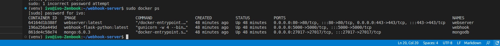

# WebHook Listener
WebHook Listener include: 3 container in one VM
 Docker container for: 
 - Web: Nginx for reverse and Gunicorn container (WSGI prod ENV) with 3 Worker in one container!!!
 - Webhook: Python server container for collect Json info
 - MongoDB: mongodb container

## IF you developer on this repo ...
Activate venv on Python!
```
cd your-project-directory
virtualenv venv -p python3 
source ./venv/bin/activate
```

## Getting started
Need Docker Compose on the host!
```
git clone https://github.com/voiz80/webhook-server.git
cd webhook-server
docker-compose up -d
```
***
## Description
Accept POST: /webhook

Accept only this below:
```
body = {'chk': chksum, 'data': sysData}
header = {'Content-type': 'application/json', 'Accept': 'text/plain'}
```
! chk:  - hmac - Keyed-Hashing for Message Authentication!
! data: - Json Object!

 - After verifycation insert "data" in mongodb
 - response: JSON Object {"message": "Data inserted successfully", "id": <inserted_id>}


Useful docker commands on this case: 
 - sudo docker stop $(sudo docker ps -a -q)   -  stop all containers
 - sudo docker container prune    - delete all containers
 - sudo docker ps    -  list all alive/restarting containers
 - sudo docker-compose up -d --build    - rebuild containers
 - sudo docker-compose down   - down all containers
***
## Description
IN DEVELOPMENT ....

